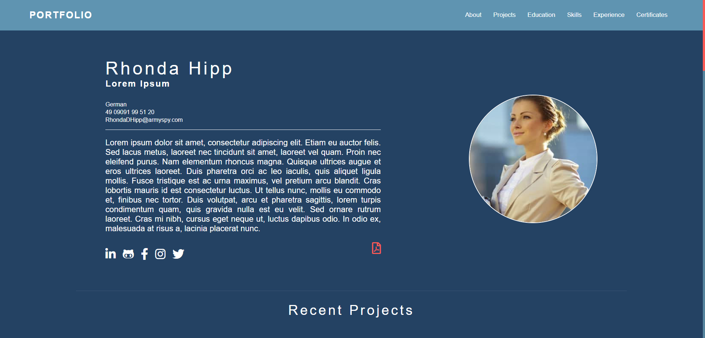

<h2 align="center">Free HTML Curriculum Template</h2>



<hr />

### Made with
* [HTML5](https://developer.mozilla.org/pt-BR/docs/Web/Guide/HTML/HTML5)
* [CSS3](https://developer.mozilla.org/pt-BR/docs/Web/CSS)
* [Javascript](https://developer.mozilla.org/pt-BR/docs/Web/JavaScript/)

### How to customize

* Basically there are four colors and you can change them in ```Assets/css/Global.css``` you just need to change the variables and all CSS will change with the colors of your preference

```
:root {
    --bg: #5F94B1;
    --dark-bg: #244263;
    --text: white;
    --secondary-text: #F95A55;
}
 ```
 
 * To put your picture, you need to replace the actual Photo.png file in ```Assets/images/Photo.png```
 * Your CV in PDF format should be placed in some directory and the link will be placed in ```Line 80``` from ```index.html```
 * Projects pictures should be placed in the ```Assets/images/```

### License
* MIT License. You can check in hte ```License``` file
* Please, don't remove the credits
